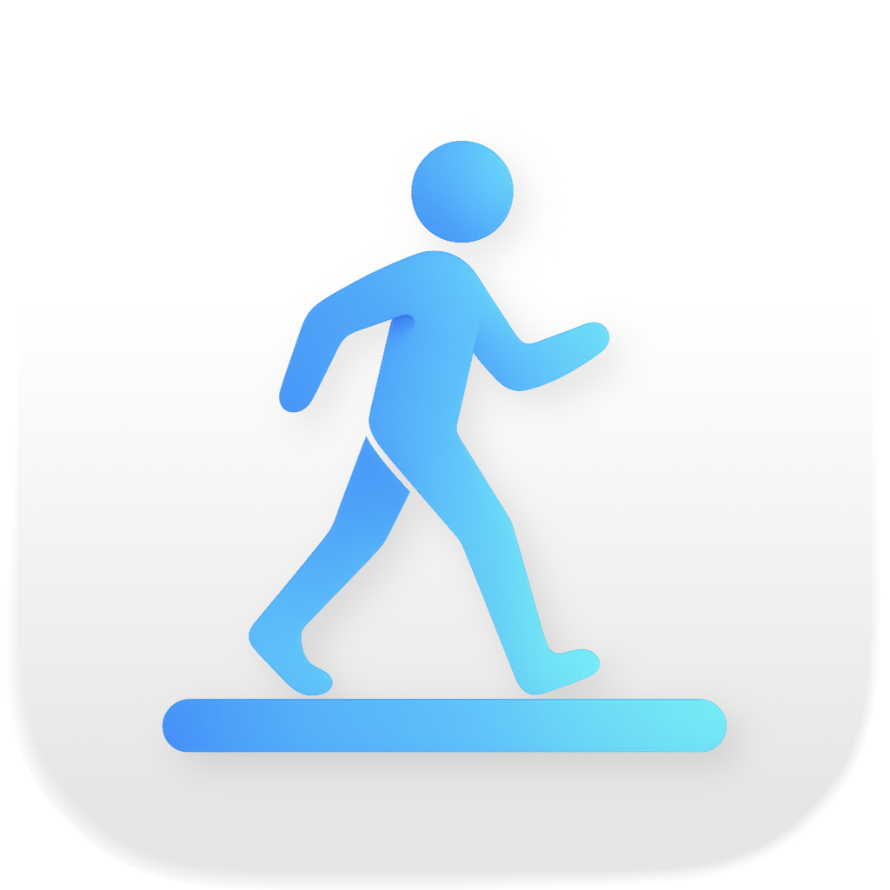

	
	<h1>WalkingMate</h1>
	

		<b>Your WalkingPad Companion for macOS</b>
	

	 

**Official website:** [walkingmate.zendit.fi](https://walkingmate.zendit.fi)

---

This repository is dedicated to **issue tracking and feature requests** for
WalkingMate, a native macOS menu bar app for controlling your WalkingPad
treadmill.

## About WalkingMate

WalkingMate is your companion app for seamless WalkingPad control:

- Control from your menu bar
- Global keyboard shortcuts
- Automatic workout tracking
- Accurate step counting
- Walking history
- CSV export

## Get WalkingMate

Download WalkingMate from the [App Store](#) or visit our
[website](https://walkingmate.zendit.fi) for more information.

## Report Issues or Request Features

If you encounter a bug or have a feature request, please
[open an issue](../../issues/new).

## Support

For general questions and support, please email: walkingmate@zendit.fi
